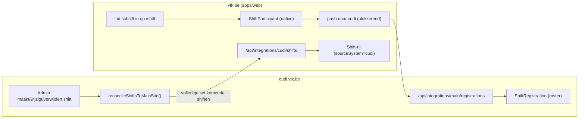

# Cursusdienst (cudi.vtk.be) ↔ VTK-website integratie

Dit document beschrijft **hoe** de koppeling tussen de VTK-main site (`apps/web`,
vtk.be) en het cursusdienst-platform (`cudi.vtk.be`, aparte repo
`/Users/d1ff1cult/Local/cursusdienst`) werkt en **hoe je ze opzet**. Voor het
*waarom* van de niet-vanzelfsprekende keuzes: zie `docs/design-decisions.md`
("Cursusdienst-shiften op de main site" en de openingsuren-sectie) en aan de
cudi-kant `docs/DESIGN_DECISIONS.md`.

Er zijn twee losse koppelingen:

| Koppeling | Richting | Standaard aan? |
|-----------|----------|----------------|
| **Openingsuren** tonen op de homepage | cudi → main (pull) | Ja (met fallback) |
| **Shiften** aanmaken op cudi, inschrijven op de main site | twee-weg | **Nee, opt-in via secret** |

> De twee apps hebben elk een eigen database en deployment. Ze praten enkel via
> HTTP met elkaar (geen gedeelde DB). cudi is de single source of truth voor
> zowel de openingsuren als de shift-definities.

---

## 1. Openingsuren (read-only)

De homepage en `/aanbod` tonen de cursusdienst-openingsuren live van cudi.

- **Bron:** `GET https://cudi.vtk.be/api/opening-hours?association=vtk` (publiek,
  geen auth; openingsuren staan sowieso publiek op de site).
- **Consument:** `apps/web/lib/cursusdienstHours.ts`. Fallback in drie trappen:
  live fetch → laatst gecachte waarde (DB-`Setting` `cursusdienst.weekHoursCache`)
  → melding "De cursusdienst openingsuren zijn momenteel niet beschikbaar".

**Opzet:** niets verplicht. Optioneel kan je de cudi-URL overriden met
`CURSUSDIENST_ORIGIN` (zie tabel onderaan). Dit staat standaard aan.

---

## 2. Shift-brug (opt-in)

Cursusdienst-shiften worden **op cudi aangemaakt** (gegenereerd uit de
openingsuren-instances), maar leden schrijven zich **op de main site** in. De
shiften tellen daar volwaardig mee voor de shift-ranking en reward-payout, dus ze
worden gespiegeld naar echte `Shift`-rijen op de main site.

### 2.1 Hoe het werkt



**a) Shift-definities: cudi → main.** Bij elke shift-mutatie op cudi (aanmaken,
wijzigen, verwijderen, en cascade-deletes via een verwijderde openingsuur-instance)
duwt cudi de **volledige set komende shiften** naar de main site
(`reconcileShiftsToMainSite` in `lib/main-site-shift-sync.ts`). De main site
(`POST /api/integrations/cudi/shifts`) upsert die als `Shift`-rijen en **pruned**
de gespiegelde toekomstige shiften die cudi niet meer stuurt. Voorbije gespiegelde
shiften blijven staan voor ranking/reward/history.

Veld-mapping (in `apps/web/lib/cudiShiftMirror.ts`, de centrale plek):
- `sourceSystem = "cudi"`, `sourceId = <cudi-shift-id>` (idempotente sleutel);
- `reward` = **1 bonnetje per begonnen uur** = `⌈(eindtijd − starttijd) / 1u⌉`
  (1u00 → 1, 1u30 → 2, 2u00 → 2, 2u01 → 3);
- `post = "Cursusdienst"` (zo verschijnen ze als aparte post in de ranking);
- `maxParticipants = maxShifters`.

**b) Inschrijven: native op de main site.** Gespiegelde shiften zijn gewone
`Shift`-rijen, dus ze verschijnen op `/shift` en lopen door de bestaande inschrijf-,
overlap-, ranking- en reward-logica. Geen aparte UI.

**c) Roster terug: main → cudi (blokkerend).** Schrijft een lid zich in/uit voor
een cursusdienst-shift, dan pusht de main site dat naar
`POST https://cudi.vtk.be/api/integrations/main/registrations`. **Blokkerend:**
lukt de cudi-call niet, dan draait de main site de native inschrijving terug en
krijgt het lid een foutmelding, zodat beide rosters strikt consistent blijven. De
capaciteit wordt op de main site afgedwongen; cudi is een tweede gate + de roster
voor de verantwoordelijken.

**d) Identiteit.** Beide `User`-modellen hebben `rNumber @unique` (het KUL-nummer).
De main site stuurt het r-nummer (+ e-mail/naam) mee; cudi lost dat op naar zijn
`User`, en **provisioneert er stil één** als die nog niet bestaat (onbruikbaar
wachtwoord; dat lid logt nooit rechtstreeks op cudi in).

**e) Vangnet.** `POST https://vtk.be/api/integrations/cudi/sync-registrations`
(voor een cron) duwt de volledige roster-set en zet zeldzame gemiste pushes gelijk.

### 2.2 Belangrijk om te weten

- **De main site wordt de roster-autoriteit.** De reconcile prunet cudi-registraties
  die de main site niet kent, dus cudi-side roster-bewerkingen voor cursusdienst-
  shiften (bv. admin die iemand handmatig toevoegt) worden overschreven. Beheer de
  roster op de main site.
- **De main-admin bewerkt gespiegelde shiften niet.** Ze zijn gemarkeerd met
  `sourceSystem="cudi"` en worden bij de volgende sync overschreven; de authoring
  gebeurt op cudi.
- **Volledig opt-in.** Zonder secret gebeurt er niets (zie 2.3).

### 2.3 Opt-in / uit by default

De hele shift-brug staat **uit** tot je het gedeelde secret zet. Zonder secret:
cudi spiegelt niets, het main-endpoint weigert alles (401), er bestaan dus geen
`sourceSystem="cudi"`-shiften, en de inschrijfflow doet geen enkele cudi-call
(exact zoals vroeger). De migratie voegt enkel twee nullable kolommen toe.

---

## 3. Opzet (activeren)

### Stap 1 — Migratie op de main site

De brug voegt `sourceSystem` + `sourceId` toe aan `Shift`
(migratie `packages/db/prisma/migrations/20260721120000_shift_source_origin`).
Toepassen op een draaiende main-DB:

```bash
npm run migrate:deploy -w @vtk/db   # productie / staging
# of in dev, met history:
npm run migrate -w @vtk/db
```

Veilig op bestaande data: twee nullable kolommen + een unieke index op
`(sourceSystem, sourceId)` (NULLs botsen niet).

### Stap 2 — Gedeeld secret genereren

```bash
openssl rand -base64 32
```

Dezelfde waarde gebruik je aan **beide** kanten.

### Stap 3 — Environment variabelen

**Main site** (root `.env` van deze repo):

```bash
CUDI_SYNC_SECRET="<gedeeld secret uit stap 2>"
# Basis-URL van cudi (default https://cudi.vtk.be); ook gebruikt door de openingsuren-pull
CURSUSDIENST_ORIGIN="https://cudi.vtk.be"
```

**Cudi** (`.env` in de cursusdienst-repo):

```bash
MAIN_SITE_SHIFT_SYNC_SECRET="<zelfde gedeelde secret>"
MAIN_SITE_ORIGIN="https://vtk.be"
MAIN_SITE_ASSOCIATION_SLUG="vtk"   # optioneel; default vtk. Enkel deze kring spiegelt
```

### Stap 4 — (optioneel) reconcile-cron

Laat een cron/uptime-pinger periodiek (bv. elke 5 min) het vangnet triggeren:

```bash
curl -X POST https://vtk.be/api/integrations/cudi/sync-registrations \
     -H "Authorization: Bearer $CUDI_SYNC_SECRET"
```

### Stap 5 — Cudi's student-shiftpagina uitzetten

Zodra inschrijven enkel nog op de main site mag: zet per kring in de cudi-admin de
shift-toggle uit (`settings.useShifts`). De admin-authoring van de shiften en de
brug-API's blijven werken; enkel de student-inschrijfpagina op cudi verdwijnt.

> Doe stap 5 pas nadat stap 1–3 live en getest zijn, anders kan er even nergens
> ingeschreven worden.

---

## 4. Lokaal testen

Beide apps draaien standaard op poort **3000**, dus geef er één een andere poort:

```bash
# terminal A — main site (deze repo)
npm run dev -w @vtk/web                 # http://localhost:3000

# terminal B — cudi
PORT=3001 npm run dev                    # http://localhost:3001
```

Env voor lokaal:

```bash
# main .env
CUDI_SYNC_SECRET="dev-secret"
CURSUSDIENST_ORIGIN="http://localhost:3001"

# cudi .env
MAIN_SITE_SHIFT_SYNC_SECRET="dev-secret"
MAIN_SITE_ORIGIN="http://localhost:3000"
```

Rooktest:
1. Maak op cudi een cursusdienst-shift aan (Admin → Slots).
2. Ze verschijnt op de main site onder `/shift`.
3. Schrijf je op de main site in → controleer dat de registratie op cudi opduikt
   (roster van de shift).
4. Schrijf je weer uit → registratie verdwijnt op cudi.

---

## 5. Referentie

### Endpoints

| Endpoint | Kant | Auth | Doel |
|----------|------|------|------|
| `GET /api/opening-hours?association=vtk` | cudi | geen (publiek) | Wekelijkse openingsuren |
| `POST /api/integrations/cudi/shifts` | main | `Bearer CUDI_SYNC_SECRET` | Shift-definities spiegelen (upsert + prune) |
| `POST /api/integrations/main/registrations` | cudi | `Bearer MAIN_SITE_SHIFT_SYNC_SECRET` | Roster schrijven (`register`/`unregister`/`reconcile`) |
| `POST /api/integrations/cudi/sync-registrations` | main | `Bearer CUDI_SYNC_SECRET` | Vangnet: volledige roster-reconcile (cron) |

### Environment variabelen

| Variabele | Kant | Default | Doel |
|-----------|------|---------|------|
| `CUDI_SYNC_SECRET` | main | — | Gedeeld secret; verifieert inkomende shift-mirror en autoriseert uitgaande roster-push. Leeg = brug uit |
| `CURSUSDIENST_ORIGIN` | main | `https://cudi.vtk.be` | Basis-URL van cudi (openingsuren-pull + roster-push) |
| `MAIN_SITE_SHIFT_SYNC_SECRET` | cudi | — | Zelfde gedeelde secret; autoriseert uitgaande shift-mirror en verifieert inkomende roster-writes. Leeg = brug uit |
| `MAIN_SITE_ORIGIN` | cudi | `https://vtk.be` | Basis-URL van de main site (shift-mirror) |
| `MAIN_SITE_ASSOCIATION_SLUG` | cudi | `vtk` | Welke kring naar de main site spiegelt |

### Belangrijke bestanden

| Bestand | Kant | Rol |
|---------|------|-----|
| `apps/web/lib/cudiShiftMirror.ts` | main | Reward-regel + post-label + veld-mapping (centrale beslissingsplek) |
| `apps/web/lib/cudiRegistrationSync.ts` | main | Roster-push + reconcile |
| `apps/web/app/api/shift/register/route.ts` | main | Native inschrijven + blokkerende cudi-push |
| `apps/web/lib/cursusdienstHours.ts` | main | Openingsuren-pull met fallback |
| `lib/main-site-shift-sync.ts` | cudi | Shift-definities naar de main site duwen |
| `app/[association]/admin/slots/actions.ts` | cudi | Shift-mutaties (hooken de mirror) |

---

## 6. Troubleshooting

| Symptoom | Waarschijnlijke oorzaak |
|----------|-------------------------|
| Cudi-shiften verschijnen niet op de main site | Secret ontbreekt of mismatcht (401), verkeerde `MAIN_SITE_ORIGIN`, of `MAIN_SITE_ASSOCIATION_SLUG` ≠ `vtk`. Check de cudi-logs op `[shift-sync]`. |
| Inschrijven faalt met "Could not sync with cursusdienst" | cudi onbereikbaar, secret-mismatch (401), of de shift bestaat niet (meer) op cudi (stale mirror; wacht op de volgende reconcile of triggert stap 4). |
| Cudi-roster loopt achter | Gemiste per-actie-push; trigger de reconcile (stap 4). |
| Openingsuren tonen "momenteel niet beschikbaar" | cudi onbereikbaar én geen gecachte waarde (bv. koude cache vlak na een deploy). Herstelt zich zodra cudi weer antwoordt. |
